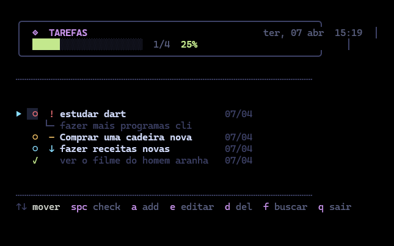

<h1 align="center">Interactive CLI Task Manager</h1>

<p align="center">A modern, keyboard-driven task manager built entirely in Dart.</p>

<p align="center">
  
  
  
</p>

<p align="center">
  
</p>

---

## Features

- **Interactive navigation** — browse tasks with arrow keys, no Enter required for most actions.
- **Visual dashboard** — progress bar, real-time stats, and pagination (6 tasks per page).
- **Priority system** — classify tasks as High (`!`), Medium (`–`), or Low (`↓`).
- **Search & filter** — find tasks by title or description; results are fully navigable.
- **Task details view** — open a dedicated view with the full task information.
- **Local persistence** — tasks are saved automatically to a local JSON file on exit.

---

## Project structure

```
TodoManagerCLI/
├── bin/
│   └── main.dart           # Entry point — interface and main logic
├── lib/
│   ├── core/
│   │   ├── database.dart   # JSON persistence layer
│   │   └── theme.dart      # Colors and terminal styling
│   ├── logic/
│   │   └── todo_manager.dart # Business logic (CRUD, filters)
│   ├── models/
│   │   └── tasks.dart      # Task data model
│   └── ui/
│       └── render.dart     # Terminal rendering
├── test/
│   └── test.dart           # Unit tests
├── assets/
│   └── screenshot.png
├── tarefas.json             # Local task database (auto-generated)
├── pubspec.yaml
└── CHANGELOG.md
```

---

## Installation

### Prerequisites

Make sure you have the [Dart SDK](https://dart.dev/get-dart) installed (version ≥ 3.0 recommended).

### 1. Clone and install dependencies

```bash
git clone https://github.com/notyalC0/TodoManagerCLI
cd TodoManagerCLI
dart pub get
```

### 2. Run directly (development)

```bash
dart run bin/main.dart
```

### 3. Activate globally (optional)

To run the app from anywhere by typing `todo`:

```bash
dart pub global activate --source path .
todo
```

---

## Controls

| Key | Action |
|-----|--------|
| `↑` `↓` | Move cursor through the task list |
| `Space` | Toggle task completion |
| `Enter` | Open task details view |
| `a` | Add a new task (title, description, priority) |
| `e` | Edit selected task — type `:q` in the title field to cancel |
| `d` | Delete selected task (requires confirmation) |
| `f` | Filter/search tasks — navigate results with `↑`/`↓`, press `Enter` to view details or `e` to edit directly |
| `q` / `Esc` | Exit — data is saved automatically |

---

## Contributing

Contributions are welcome. To get started:

1. Fork the repository and create a branch for your feature or fix.
2. Run `dart test` to make sure existing tests pass.
3. Open a pull request with a clear description of your changes.
4. Report bugs or suggest improvements via the **Issues** tab.

---

## License

This project is licensed under the **MIT License** — see the [`LICENSE`](LICENSE) file for details.

<br>

<p align="center">Developed by <b>notyalC</b></p>
